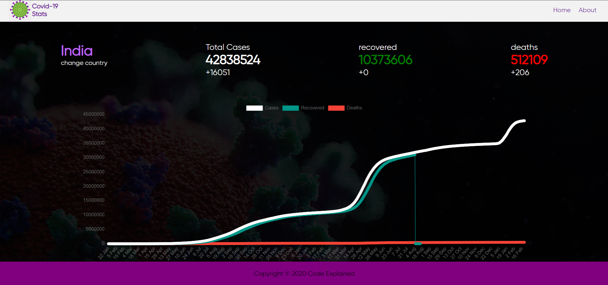

# **covistat**   

#### **EXPLORING MODULES**

## Description
'COVISTAT'-It has the wonderful UI which shows the daily covid stats of the world with        
graph , easy understandable mode . APIs used to show all the stats .

## 🔗 Links

- Website link: [Link to website](https://covistat.netlify.app/)

## 🤖 Technology Stack

## Screenshots

